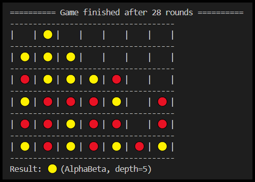

# Combinatorium

Welcome to Combinatorium, a collection of classic two-player combinatorial games with an AI twist! This repository provides implementations for several popular games along with various agent algorithms you can play against.


## Installation

1. Clone the repository:

```bash
git clone https://github.com/hoverslam/combinatorium
```

2. Navigate to the directory:

```bash
cd combinatorium
```

3. Set up a virtual environment:

```bash
# Create a virtual environment
python -3.12 -m venv .venv

# Activate the virtual environment (Windows)
.venv\Scripts\activate

# Activate the virtual environment (Unix or MacOS)
source .venv/bin/activate
```

4. Install the dependencies:

```powershell
pip install -r requirements.txt
```


## Usage

```powershell
python -m main -g "ConnectFour" -p1 "Human" -p2 "Random"
```

For possible options use ```--help``` :
```powershell
python -m main --help
```
```
usage: Combinatorium [-h] -g {TicTacToe,ConnectFour} -p1 {Human,Random,Minimax,Negamax,AlphaBeta} -p2
                     {Human,Random,Minimax,Negamax,AlphaBeta}

A collection of combinatorial games.

options:
  -h, --help            show this help message and exit
  -g {TicTacToe,ConnectFour}
                        select a game
  -p1 {Human,Random,Minimax,Negamax,AlphaBeta}
                        select an agent for player one
  -p2 {Human,Random,Minimax,Negamax,AlphaBeta}
                        select an agent for player two
```

## Games

A table for complexities of some well-known games can be found [here](https://en.wikipedia.org/wiki/Game_complexity#Complexities_of_some_well-known_games).

### Tic-tac-toe

Tic-tac-toe is a classic two-player game played on a 3x3 grid. Players take turns marking spaces with an ***X*** or ***O***. The first player to get three of their marks in a row (horizontally, vertically, or diagonally) wins. This game is a great introduction to basic game mechanics and strategic thinking. The state space complexity is rather small with only 5 478 different states (after removing illegal positions). Reference: [Wikipedia | Tic-tac-toe](https://en.wikipedia.org/wiki/Tic-tac-toe)


### Connect Four

Connect Four is another two-player game played on a 7x6 grid. Players take turns dropping colored discs into one of the seven columns. The discs fall down the column and land on the first available space. The goal is to be the first player to connect four of your discs horizontally, vertically, or diagonally. Reference: [Wikipedia | Connect Four](https://en.wikipedia.org/wiki/Connect_Four)



## Agents

### Minimax

Minimax is a fundamental decision-making algorithm used for two-player zero-sum games. It explores all possible game continuations and chooses the move that leads to the best outcome for itself (or the worst outcome for the opponent).

Reference: [Wikipedia | Minimax](https://en.wikipedia.org/wiki/Minimax)

### Alpha-beta pruning

Alpha-beta pruning is an optimization technique used to improve the efficiency of the minimax algorithm. It prunes away branches that can't possibly be the best option, focusing on more promising parts of the search tree.

Reference: [Wikipedia | Alpha–beta pruning](https://en.wikipedia.org/wiki/Alpha%E2%80%93beta_pruning)

### Negamax

Negamax is a variant of minimax that simplifies the implementation for zero-sum games. It transforms the game into a maximization problem for both players, regardless of whose turn it is.

Reference: [Wikipedia | Negamax](https://en.wikipedia.org/wiki/Negamax)

### Monte Carlo tree search (MCTS)

MCTS is another tree search technique. Unlike minimax, which explores all options, MCTS builds a tree and simulates random games from each branch to find promising moves. It balances exploring new strategies with exploiting what works.

Reference: [Wikipedia | Monte Carlo tree search](https://en.wikipedia.org/wiki/Monte_Carlo_tree_search)
